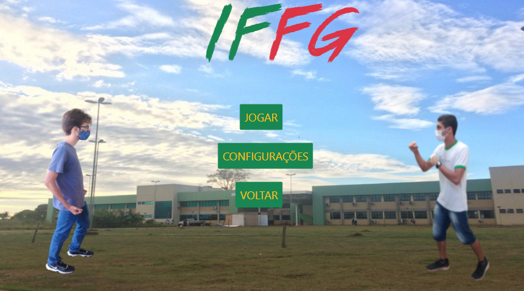

# Instituto Federal Fight Game

## Sobre

Instituto Federal Fight Game é um projeto final de curso técnico integrado em informática, desenvolvido pelos estudantes 
__Wilker Sebastian Afonso Pereira e Nicolas Almeida Valente__, com a orinteção de __Fabio Luiz__.

## Objetivo

Desenvolver um jogo de luta com tema, personagens e ambiente do __Instituto Federal de Mato Grosso do Sul__ para web aplicando todos os conceitos aprendidos dutante as disciplinas de desenvolvimento "WEB 1" e "WEB 2".

## Tecnologias

- Nodejs
- NPM
- Express
- Typescript
- Javascript
- HTML
- CSS 
- BootStrap
- HandleBars
- HEROKU
- ENV